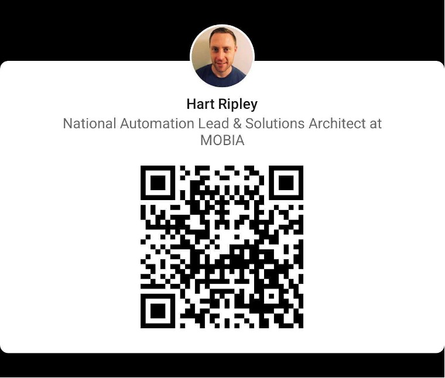

# Secure, Dynamic Certificate Lifecycle Management

The purpose of this repository is to provide examples, tools, and operators for Kubernetes to orchestrate certificate workflows and lifecycle management.

> **_IMPORTANT: Tools and operators can run on any Kubernetes distribution. Additional tools and operators are included for use with Red Hat OpenShift routes._**

## Certificate Pipeline Requirements/Prerequisites
* Source Code Management Repository
    * GitLab 
    * GitHub
    * Other
* Kubernetes Cluster
  * OpenShift 
    * [Code Ready Containers (CRC)](https://developers.redhat.com/download-manager/link/3868678)
      * [CRC Direct Mirror](https://mirror.openshift.com/pub/openshift-v4/clients/crc/latest/)
  * xKS
    * [Amazon EKS](https://github.com/hashicorp/learn-terraform-provision-eks-cluster)
    * [Azure AKS](https://github.com/hashicorp/learn-terraform-provision-aks-cluster)
    * [Google GKE](https://github.com/hashicorp/learn-terraform-provision-gke-cluster)
* [cert-manager](https://cert-manager.io/docs/installation/) Operator installed and configured
  * [Default static install](https://cert-manager.io/docs/installation/#default-static-install)
* DNS Zone Credentials/HTTP validation
  * For Azure: [Service Principal](https://cert-manager.io/docs/configuration/acme/dns01/azuredns/#service-principal)
    * [AzureDNS](https://cert-manager.io/docs/configuration/acme/dns01/azuredns/)

### Optional: Future
* Self-Service Developer Portal
  * Web frontend where consumers of the platform can request certain items in a self-serve fashion
* RunWhen Local
  * [RunWhen Local](https://docs.runwhen.com/public/v/runwhen-local/user-guide/getting-started/getting_started-running_in_kubernetes) - your personal troubleshooter's toolbox for CLI commands, specifically designed to troubleshoot applications in your Kubernetes environment

### Certificate and Secret Utility Operators
* [kubernetes-reflector](https://github.com/EmberStack/kubernetes-reflector)
* [Cert Utils Operator](https://github.com/redhat-cop/cert-utils-operator)
* [Kubernetes Configuration Syncer (kubed)](https://config-syncer.com/docs/v0.14.7/guides/config-syncer/intra-cluster/)

> **_NOTE: Red Hat OpenShift can leverage additional Operators for certificate and private key management for route with the `cert-utils` operator._**

## Install Cert-Manager

```shell
kubectl apply -f https://github.com/cert-manager/cert-manager/releases/download/v1.14.4/cert-manager.yaml
```
## Create the Azure Service Principal

> **_NOTE: Azure (azure-cli (az)) and jq are required._**

* Define the following variable:
  * Service Principal Name
  * Resource Group Name,
  * DNS Zone FQDN

```shell
AZURE_CERT_MANAGER_NEW_SP_NAME=<service_princial_name>
AZURE_DNS_ZONE_RESOURCE_GROUP=<dns_resource_group_name>
AZURE_DNS_ZONE=<fqdn_of_dns_zone>
```

* Create the Service Principal 

```shell
$ DNS_SP=$(az ad sp create-for-rbac --name $AZURE_CERT_MANAGER_NEW_SP_NAME --output json)
$ AZURE_CERT_MANAGER_SP_APP_ID=$(echo $DNS_SP | jq -r '.appId')
$ AZURE_CERT_MANAGER_SP_PASSWORD=$(echo $DNS_SP | jq -r '.password')
$ AZURE_TENANT_ID=$(echo $DNS_SP | jq -r '.tenant')
$ AZURE_SUBSCRIPTION_ID=$(az account show --output json | jq -r '.id')
```

* Delete the `Contributor` role assignment from the Service Principal

```shell
az role assignment delete --assignee $AZURE_CERT_MANAGER_SP_APP_ID --role Contributor
```

* Ensure permissions assigned are explicit and least-priv by adding the `DNS Zone Contributor` role to the Service Principal

```shell
DNS_ID=$(az network dns zone show --name $AZURE_DNS_ZONE --resource-group $AZURE_DNS_ZONE_RESOURCE_GROUP --query "id" --output tsv)

az role assignment create --assignee $AZURE_CERT_MANAGER_SP_APP_ID --role "DNS Zone Contributor" --scope $DNS_ID
```

**Example Output:**

```json
{
  "canDelegate": null,
  "condition": null,
  "conditionVersion": null,
  "description": null,
  "id": "/subscriptions/xxxxxxxxx-xxxx-xxxx-xxxx-xxxxxxxxxxxx/resourceGroups/dns-rg/providers/Microsoft.Network/dnszones/domain-of-authenticity.hartripley.com/providers/Microsoft.Authorization/roleAssignments/xxxxxxxxx-xxxx-xxxx-xxxx-xxxxxxxxxxxx",
  "name": "xxxxxxxxx-xxxx-xxxx-xxxx-xxxxxxxxxxxx",
  "principalId": "xxxxxxxxx-xxxx-xxxx-xxxx-xxxxxxxxxxxx",
  "principalType": "ServicePrincipal",
  "resourceGroup": "dns-rg",
  "roleDefinitionId": "/subscriptions/xxxxxxxxx-xxxx-xxxx-xxxx-xxxxxxxxxxxx/providers/Microsoft.Authorization/roleDefinitions/xxxxxxxxx-xxxx-xxxx-xxxx-xxxxxxxxxxxx",
  "scope": "/subscriptions/xxxxxxxxx-xxxx-xxxx-xxxx-xxxxxxxxxxxx/resourceGroups/dns-rg/providers/Microsoft.Network/dnszones/domain-of-authenticity.hartripley.com",
  "type": "Microsoft.Authorization/roleAssignments"
}
```

* Check Role Assignment

```shell
az role assignment list --all --assignee $AZURE_CERT_MANAGER_SP_APP_ID
```

**Example Output:**

```json
[
  {
    "canDelegate": null,
    "condition": null,
    "conditionVersion": null,
    "description": null,
    "id": "/subscriptions/xxxxxxxxx-xxxx-xxxx-xxxx-xxxxxxxxxxxx/resourceGroups/dns-rg/providers/Microsoft.Network/dnszones/domain-of-authenticity.hartripley.com/providers/Microsoft.Authorization/roleAssignments/xxxxxxxxx-xxxx-xxxx-xxxx-xxxxxxxxxxxx",
    "name": "xxxxxxxxx-xxxx-xxxx-xxxx-xxxxxxxxxxxx",
    "principalId": "xxxxxxxxx-xxxx-xxxx-xxxx-xxxxxxxxxxxx",
    "principalName": "xxxxxxxxx-xxxx-xxxx-xxxx-xxxxxxxxxxxx",
    "principalType": "ServicePrincipal",
    "resourceGroup": "dns-rg",
    "roleDefinitionId": "/subscriptions/xxxxxxxxx-xxxx-xxxx-xxxx-xxxxxxxxxxxx/providers/Microsoft.Authorization/roleDefinitions/xxxxxxxxx-xxxx-xxxx-xxxx-xxxxxxxxxxxx",
    "roleDefinitionName": "DNS Zone Contributor",
    "scope": "/subscriptions/xxxxxxxxx-xxxx-xxxx-xxxx-xxxxxxxxxxxx/resourceGroups/dns-rg/providers/Microsoft.Network/dnszones/domain-of-authenticity.hartripley.com",
    "type": "Microsoft.Authorization/roleAssignments"
  }
]
```

## Define an Issuer 

> **_NOTE: A cert-manager `Issuer` is namespace scoped._**

* Create the secret in the Issuer namespace

```shell
kubectl create secret generic azuredns-config --from-literal=azuredns-sp-secret=$AZURE_CERT_MANAGER_SP_PASSWORD -n cert-manager
```

```shell
cat <<EOF | kubectl create -f -
apiVersion: cert-manager.io/v1
kind: Issuer
metadata:
  name: the-issuer
  namespace: cert-manager
spec:
  acme:
    server: https://acme-v02.api.letsencrypt.org/directory #Production ACME URL
    privateKeySecretRef:
      name: issuer-letsencrypt-prod
    solvers:
    - dns01:
        azureDNS:
          clientID: $AZURE_CERT_MANAGER_SP_APP_ID
          clientSecretSecretRef:
            name: azuredns-config
            key: azuredns-sp-secret
          subscriptionID: $AZURE_SUBSCRIPTION_ID
          tenantID: $AZURE_TENANT_ID
          resourceGroupName: $AZURE_DNS_ZONE_RESOURCE_GROUP
          hostedZoneName: $AZURE_DNS_ZONE
          environment: AzurePublicCloud
EOF
```
## Define an ClusterIssuer

```shell
cat <<EOF | kubectl create -f -
apiVersion: cert-manager.io/v1
kind: ClusterIssuer
metadata:
  name: the-cluster-issuer
spec:
  acme:
    server: https://acme-staging-v02.api.letsencrypt.org/directory #Production ACME URL
    email: hart@hartripley.com
    privateKeySecretRef:
      name: cluster-issuer-letsencrypt-staging
    solvers:
    - dns01:
        cnameStrategy: Follow 
        azureDNS:
          clientID: $AZURE_CERT_MANAGER_SP_APP_ID
          clientSecretSecretRef:
            name: azuredns-config
            key: azuredns-sp-secret
          hostedZoneName: $AZURE_DNS_ZONE
          resourceGroupName: $AZURE_DNS_ZONE_RESOURCE_GROUP
          subscriptionID: $AZURE_SUBSCRIPTION_ID
          tenantID: $AZURE_TENANT_ID
          environment: AzurePublicCloud
EOF
```

## Setup Kubernetes Config Syncer

* Install Helm

```shell
wget https://get.helm.sh/helm-v3.14.3-linux-arm64.tar.gz
tar -zxvf helm-v3.14.3-linux-arm64.tar.gz
mv linux-amd64/helm /usr/local/bin/helm
```

* Add the Kubernetes Config Syncer Helm repo

```shell
helm repo add appscode https://charts.appscode.com/stable/
helm repo update
```

* Get Kubernetes Cluster ID:

> **_NOTE: Kubernetes Config Syncer requires a free license._**

```shell
kubectl get ns kube-system -o=jsonpath='{.metadata.uid}'

9fe296ed-6f2a-4737-a062-5e63c851dcff
```

* Get free license [Kubernetes Configuration Syncer (kubed) License](https://appscode.com/issue-license?p=config-syncer):

* Save it as a `.txt` file on the control/bastion host

* Update/create Helm values file [values.yaml](https://github.com/config-syncer/config-syncer/blob/release-0.14/charts/config-syncer/values.yaml)

* Template out the Helm install to a Kubernetes manifest file

```yaml
helm template appscode/config-syncer \
  --version v0.14.7 \
  --namespace kubeops --create-namespace \
  --set-file license=config-syncer-license-9fe296ed-6f2a-4737-a062-5e63c851dcff.txt \
  --set config.configSourceNamespace=cert-manager \
  --set config.clusterName=domain-of-authenticity \
  --no-hooks > config-syncer.yaml
```

* Create the namespace for config-syncer

```yaml
cat <<EOF | kubectl create -f -
apiVersion: v1
kind: Namespace
metadata:
  name: kubeops
  annotations:
    openshift.io/display-name: kubeops
EOF
```

* Apply the Helm template to deploy the Kubernetes Config Syncer

```shell
kubectl apply -f config-syncer.yaml
```

* Label the the desired namespace(s) to mirror the certificate(s)
  * Additional abels can be added to a namespace to sync multiple certificates

> **_NOTE: If namespace already exists, add the label to have the Kubernetes Config Syncer mirror the certificate._**

```shell
kubectl label namespace runwhen-local cert=lets-encrypt-wc
```

## Let's Encrypt Secret Creation

> **_NOTE: Prior to requesting a certificate via a Certificate Signing Request (CSR) the secret in the desired source namespace/project **MUST** be created to ensure the Kubernetes Config Syncer annotations are included._**

* Create the secret `cert-manager` namespace is used here as the location

```yaml
cat <<EOF | kubectl create -f -
apiVersion: v1
data:
  ca.crt: ''
  tls.crt: ''
  tls.key: ''
kind: Secret
metadata:
  name: le-wc-staging
  namespace: cert-manager
  annotations:
    kubed.appscode.com/sync: "cert=lets-encrypt-wc" # Label value to sync certificates to labelled namespaces/projects
type: kubernetes.io/tls
EOF
```

> **_NOTE: If certificate has already been requested and issued and the secret is created, just add the Kubernetes Config Syncer annotation shown below:_**

```shell
kubectl annotate secret le-wc-staging kubed.appscode.com/sync="cert=lets-encrypt-wc" -n cert-manager

kubectl annotate secret le-wc-prod kubed.appscode.com/sync="cert=lets-encrypt-wc" -n cert-manager
```

## Create Certificate Signing Request

> **_NOTE: The DNS zone must exist in Azure._**

```shell
apiVersion: cert-manager.io/v1
kind: Certificate
metadata:
  name: le-wc-staging
  namespace: cert-manager
spec:
  secretName: le-wc-staging
  issuerRef:
    name: the-cluster-issuer
    kind: ClusterIssuer
  commonName: '*.domain-of-authenticity.hartripley.com'
  dnsNames:
  - domain-of-authenticity.hartripley.com
  - '*.domain-of-authenticity.hartripley.com'
  acme:
    config:
    - dns01:
        provider: azuredns
      domains:
      - domain-of-authenticity.hartripley.com
      - '*.domain-of-authenticity.hartripley.com'
```

## Create Custom Domain Route

> **_NOTE: OpenShift uses routes to terminate TLS and serve HTTP/HTTPS traffic. Routes can also be used for custom domain hostname URL's, certificate are applied to the route._**

```shell
kubectl create route edge --service=runwhen-local runwhen-local-cd --port=mkdocs --hostname=runwhen-local.domain-of-authenticity.hartripley.com -n runwhen-local

kubectl create route edge --service=runwhen-local runwhen-local-prod --port=mkdocs --hostname=runwhen-local.domain-of-authenticity.hartripley.com -n runwhen-local
```

## Create Custom Domain Route from YAML - Staging

* Apply route manifest for staging route

```yaml
apiVersion: route.openshift.io/v1
kind: Route
metadata:
  labels:
    app.kubernetes.io/instance: runwhen-local
    app.kubernetes.io/managed-by: Helm
    app.kubernetes.io/name: runwhen-local
    app.kubernetes.io/version: 0.3.10
    helm.sh/chart: runwhen-local-0.0.24
    annotations:
      cert-utils-operator.redhat-cop.io/certs-from-secret: le-wc-staging
  name: runwhen-local-staging
  namespace: runwhen-local
spec:
  host: runwhen-local.domain-of-authenticity.hartripley.com
  port:
    targetPort: mkdocs
  tls:
    termination: edge
  to:
    kind: Service
    name: runwhen-local
    weight: 100
  wildcardPolicy: None
```

* Annotate route to have the cert-utils operator apply the key and certificate to the route

```shell
kubectl annotate route runwhen-local-cd cert-utils-operator.redhat-cop.io/certs-from-secret=le-wc-staging -n runwhen-local
```

## Create Custom Domain Route from YAML - Prod

* Apply route manifest for prod route

```yaml
apiVersion: route.openshift.io/v1
kind: Route
metadata:
  labels:
    app.kubernetes.io/instance: runwhen-local
    app.kubernetes.io/managed-by: Helm
    app.kubernetes.io/name: runwhen-local
    app.kubernetes.io/version: 0.3.10
    helm.sh/chart: runwhen-local-0.0.24
    annotations:
      cert-utils-operator.redhat-cop.io/certs-from-secret: le-wc-prod
  name: runwhen-local-prod
  namespace: runwhen-local
spec:
  host: runwhen-local.domain-of-authenticity.hartripley.com
  port:
    targetPort: mkdocs
  tls:
    termination: edge
  to:
    kind: Service
    name: runwhen-local
    weight: 100
  wildcardPolicy: None
```

* Annotate route to have the cert-utils operator apply the key and certificate to the route

```shell
kubectl annotate route runwhen-local-prod cert-utils-operator.redhat-cop.io/certs-from-secret=le-wc-prod -n runwhen-local
```

## Install cert-utils operator

[Deploying from OperatorHub UI](https://github.com/redhat-cop/cert-utils-operator?tab=readme-ov-file#deploying-from-operatorhub-ui)

## Workflow

Cert Manager Operator --> Kubernetes RBAC --> IDP Credentials --> Issuer/ClusterIssuer --> Certificate Request/Issuance --> Certificate Renewal/Revocation/Request 

# Let's Connect!

Please reach out:


